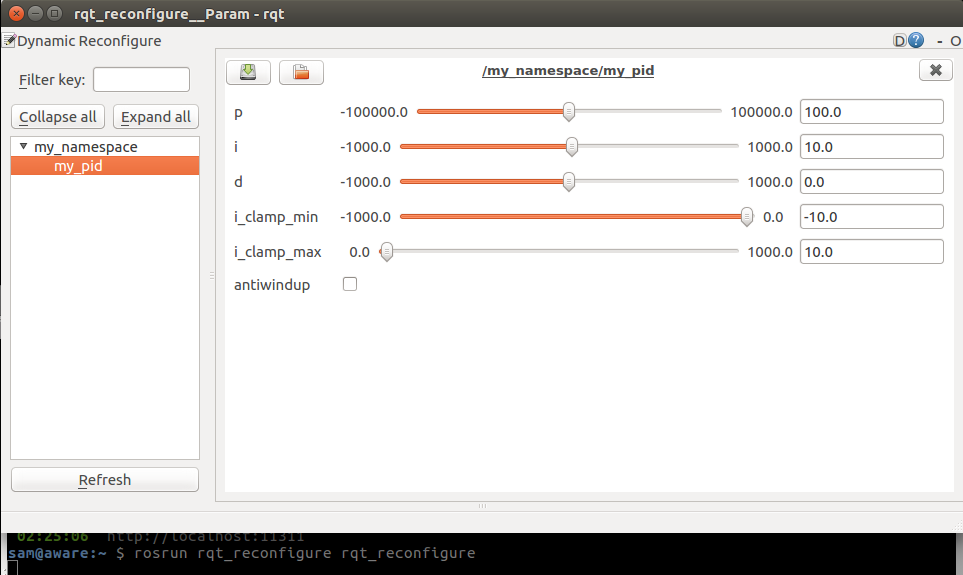

# control_toolbox_pid_tutorial
I found myself with some difficulties to understand how to use the
`control_toolbox::pid` class. After struggling to make it work, here I share
my findings with a tutorial package to get you set up!

First, docs from the **Pid** class: http://docs.ros.org/api/control_toolbox/html/classcontrol__toolbox_1_1Pid.html

Mainly the interesting bits of this package are in [src/example.cpp](src/example.cpp).

It implements a pid controller for a made up `geometry_msgs/Twist` cmd_vel. There is
nothing to actually control for real, but you can play with the parts and find a
working pid implementation with dynamic reconfigure to tune it available.

You should be able to build this package with something like:
```bash
mkdir -p pid_ws/src
cd pid_ws/src
git clone https://github.com/awesomebytes/control_toolbox_pid_tutorial
cd ..
catkin build
source devel/setup.bash
```

You can run the example node with:

```bash
rosrun control_toolbox_pid_tutorial pid_example
```

# Dynamic reconfigure
Looks like this:



# PID state topic
If before starting the node that contains the PID you set the parameter `publish_state` in the param server to true, you'll get access to the PID internal state.
```bash
$ rostopic echo /my_namespace/my_pid/state
header: 
  seq: 992
  stamp: 
    secs: 1545405985
    nsecs: 449541433
  frame_id: ''
timestep: 
  secs: 0
  nsecs: 100291320
error: 0.0
error_dot: 0.0
p_error: 0.0
i_error: 0.0
d_error: 0.0
p_term: 0.0
i_term: 0.0
d_term: 0.0
i_max: 10.0
i_min: -10.0
output: 0.0
---
```

# Debug all together
In my case, to debug what is going on I use:

* `rosrun rqt_robot_steering rqt_robot_steering` (or `rqt` adding the plugin) to send `geometry_msgs/Twist` commands to a topic.
* `rosrun rqt_reconfigure rqt_reconfigure` (or `rqt` adding the plugin) to play with the PID gains.
* `rosrun plotjuggler PlotJuggler` [PlotJuggler](https://facontidavide.github.io/PlotJuggler) to visualize in real time the different inputs and outputs, including the PID state, in case that helps debugging (it may help to choose i_clamp values of the PID). [rqt_multiplot](http://wiki.ros.org/rqt_multiplot) could be used too (as rqt plugin probably).
* Some `rostopic echo` of the topics that come in and out. They are useful sometimes too.
* `rosbag record` and `rosbag play` to check in an offline fashion.

# Stuff you may need installed
```bash
sudo apt-get install ros-kinetic-control-toolbox ros-kinetic-rqt-reconfigure ros-kinetic-plotjuggler ros-kinetic-rqt-robot-steering
```

But chances are you already have them.